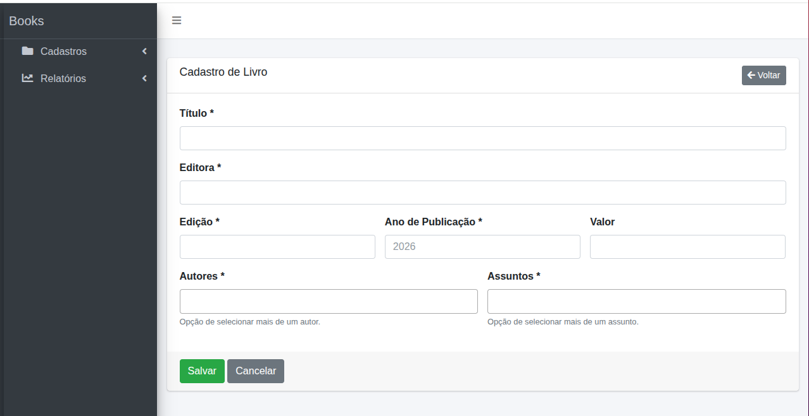
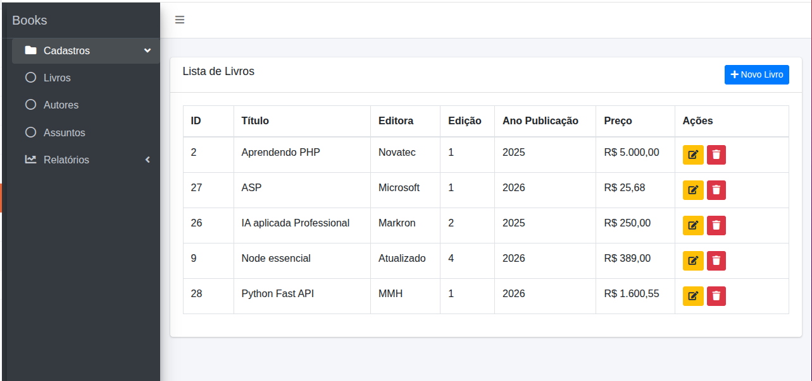

# Cadastro de Livros

## Descrição

Sistema desenvolvido em Laravel para gerenciamento de Livros, Autores e Assuntos.

## Tecnologias Utilizadas

* PHP 8
* Laravel 8
* PostgreSQL
* Bootstrap
* AdminLTE

## Demonstração Online

Sistema disponível para acesso em:

**URL:** http://45.55.69.108/

# Script de Instalação
## 1. Clonar o projeto

git clone https://github.com/rpellegrini/app-bookstore.git
cd app-bookstore

## 2. Copiar o arquivo de ambiente
cp .env.example .env

## 3. Subir os containers
docker compose up -d --build

## 4. Instalar as dependências do PHP
docker compose exec laravel_app composer install

## 5. Gerar a chave da aplicação
docker compose exec laravel_app php artisan key:generate

## 6. Rodar as migrations 
docker compose exec laravel_app php artisan migrate

## 7. Acessar o sistema:
http://localhost:8080

## Cadastro de Livros

## Listagem dos Livros

## Autor

Rodrigo Pellegrini
